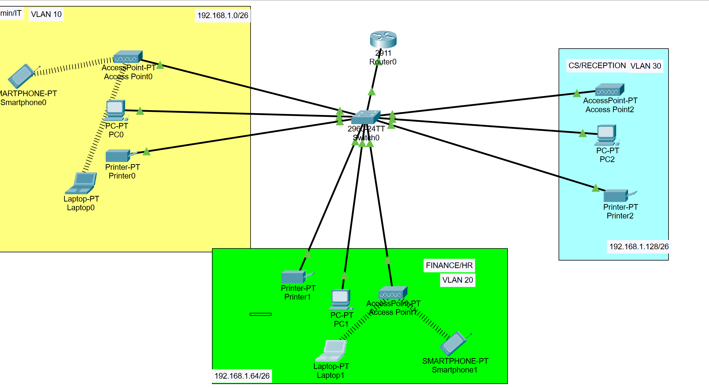

# SOHO Network Design & Implementation Project
## Overview
This project simulates a small office network with three departments - Admin/IT, Finance/HR, and Customer Service/Reception - each segmented into its own VLAN for security and traffic isolation. The network includes a single Layer 3 router, a core switch, and a mix of wired and wireless end devices (PCs, laptops, printers, smartphones) across each department.

*Ref 1. Small Office Network Topology Diagram*

## Scenario / Requirements
The company provided the following requirements for the branch network implementation:

a. One router and one switch, both Cisco products

b. Three departments: Admin/IT, Finance/HR, and Customer Service/Reception

c. Each department must be on a separate VLAN

d. Each department must have wireless network access for its users

e. Host devices must obtain an IPv4 address automatically (via DHCP)

f. Devices across all departments must be able to communicate with each other

The ISP assigned a base network of **192.168.1.0**, which had to be subnetted to accommodate all three departments.

## Objective
The goal of this lab was to design a simple, practical network for a small office where different departments need to be logically separated for security and organizational purposes, while still being able to route between them and reach external networks through a single router.

## Topology Summary
- **Router**: Cisco 2911 (Router0) acting as the gateway for all VLANs
- **Core Switch**: Cisco 2960-24TT (Switch0) connecting all departments and the router
- **Admin/IT (VLAN 10)** - Subnet: 192.168.1.0/26
  - 1 PC, 1 Laptop, 1 Printer, 1 Smartphone (wireless), 1 Access Point
- **Finance/HR (VLAN 20)** - Subnet: 192.168.1.64/26
  - 1 PC, 1 Laptop, 1 Printer, 1 Smartphone (wireless), 1 Access Point
- **CS/Reception (VLAN 30)** - Subnet: 192.168.1.128/26
  - 1 PC, 1 Printer, 1 Access Point

## What I Built
- **VLAN segmentation**: Created three VLANs (10, 20, 30) to separate Admin/IT, Finance/HR, and CS/Reception traffic on the same physical switch
- **Subnetting**: Divided the 192.168.1.0/24 address space into three /26 subnets, one per VLAN, to support each department's device count
- **Access points per VLAN**: Deployed a wireless access point in each department, allowing smartphones and other wireless devices to join the correct VLAN
- **Router-on-a-stick / inter-VLAN routing**: Configured the router to provide connectivity between VLANs and act as the default gateway for each subnet
- **End device configuration**: Assigned static IP addressing to PCs, laptops, and printers within their respective VLAN subnets

## Key Findings / Verification
- Verified that devices within the same VLAN/department could communicate with each other directly
- Verified that devices in different VLANs (e.g. Admin/IT to Finance/HR) could only communicate through the router, confirming proper VLAN isolation at Layer 2
- Confirmed wireless devices (smartphones) successfully associated with their department's access point and received addressing within the correct subnet
- Tested connectivity using `ping` between devices across VLANs to confirm inter-VLAN routing was functioning correctly

## Tools Used
Cisco Packet Tracer, VLANs, Subnetting (/26), Inter-VLAN Routing, Wireless Access Points, Static IP Addressing, ROAS

## Credit
This lab is based on a tutorial from a YouTube playlist on network fundamentals and VLAN configuration in Cisco Packet Tracer. I followed along with the video to build and configure this network, then documented my own implementation here.

Original tutorial: https://www.youtube.com/watch?v=F_dSpaTMyuA&list=PLvUOx2WG6R7PMM8UhMWevH75QzGyXOv4g&index=2
